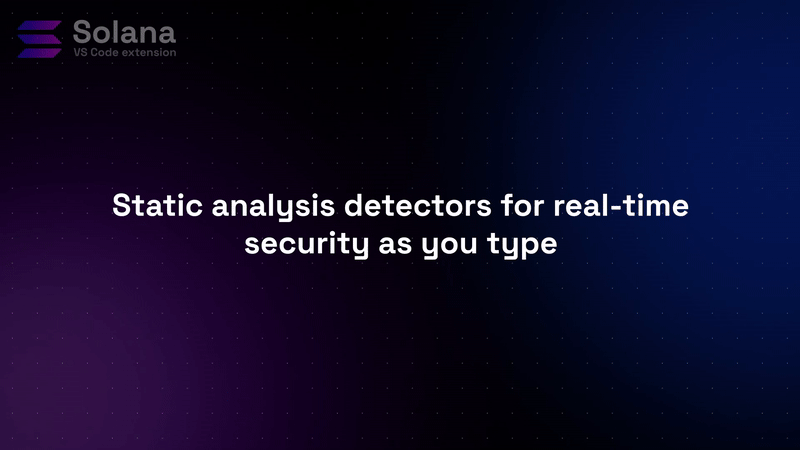
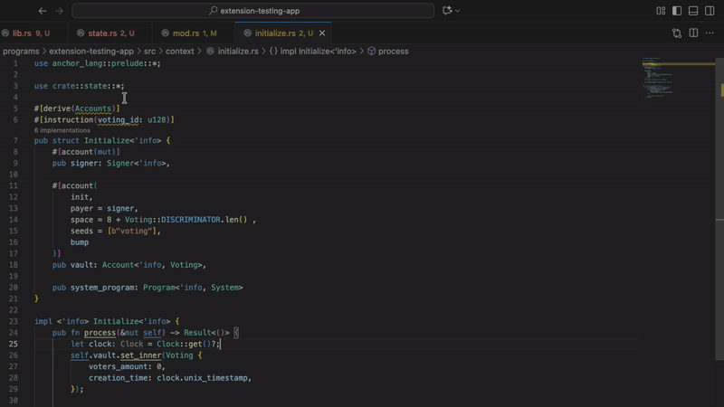
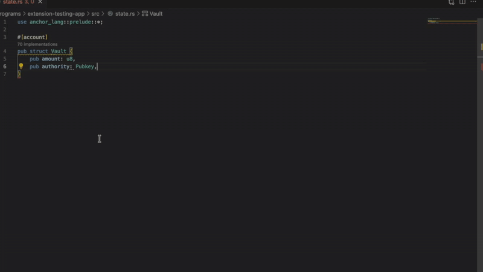
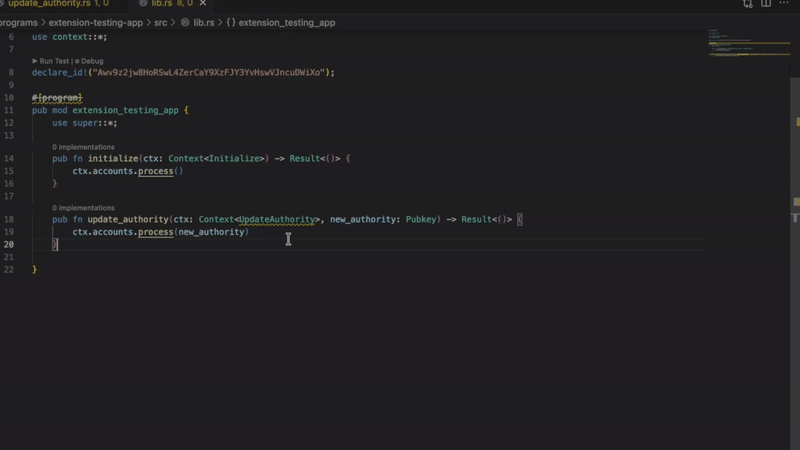
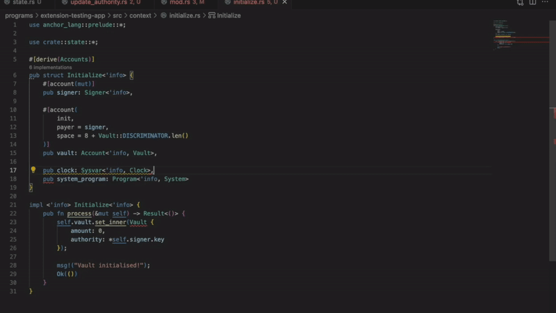
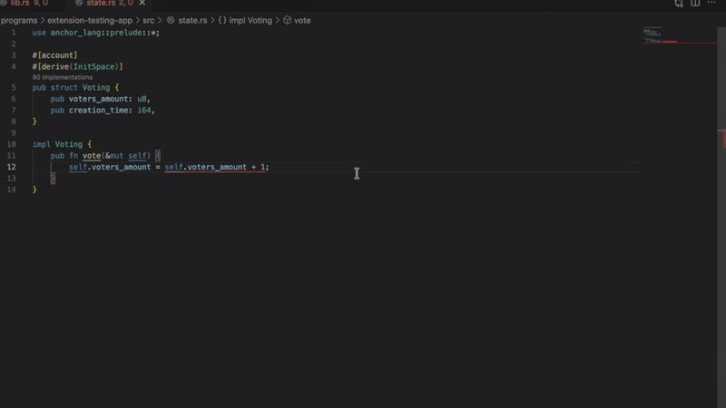
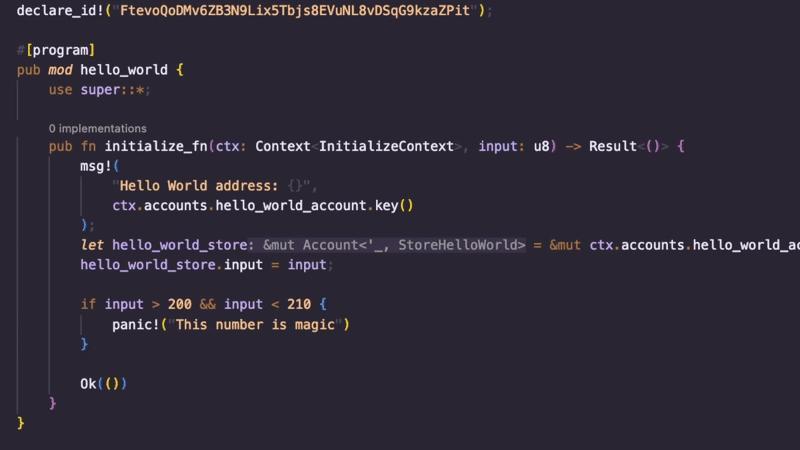

# Solana by Ackee Blockchain Security

[](https://discord.gg/x7qXXnGCsa)
[](https://marketplace.visualstudio.com/items?itemName=AckeeBlockchain.solana)
[](https://x.com/TridentSolana)



The first Solana extension with built-in static analysis detectors and fuzzing coverage visualization. Catch common security vulnerabilities as you code and see exactly which lines Trident fuzz tests cover, without leaving your IDE.

Even experienced developers miss things. Code reviews miss things. Tests miss edge cases.
This extension adds an extra pair of eyes - catching common issues in real-time and showing you which paths your fuzz tests actually covered.
Part of professional development workflow, not a replacement for good practices.

<br clear="left"/>

## Built-in Static Analysis Detectors

Enhance your Solana development workflow with built-in security scanning. The extension automatically detects common security issues in your Solana programs.

**Manual Lamports Zeroing**: Detects unsafe manual lamports zeroing patterns

**Missing Check Comment**: Identifies critical code sections lacking security check comments

**Immutable Account Mutated**: Identifies when code attempts to modify an account marked as immutable

**Instruction Attribute Invalid**: Detects invalid instruction attributes that could cause runtime errors

**Instruction Attribute Unused**: Finds unused instruction attributes that might indicate logic errors



**Missing InitSpace Macro**: Catches account creation without proper space initialization



**Missing Signer**: Alerts when code fails to verify required signers



**Sysvar Account**: Detects improper sysvar account access methods



**Unsafe Math**: Identifies mathematical operations that could lead to overflows



## Trident Fuzzing Coverage Visualization

### 1. How to Integrate with Trident

The integration is automatic once you have the proper structure:

- **Directory Structure**: The extension activates when it detects a `trident-tests` directory in your workspace
- **Coverage Data Location**: The extension looks for coverage reports in `trident-tests` directory
- **Coverage Format**: Uses `cargo llvm-cov` to generate JSON coverage reports

**Commands available:**

- `solana: Show Code Coverage` - Opens coverage visualization
- `solana: Close Code Coverage` - Closes coverage display

The extension offers two coverage modes:

- **Static**: Load an existing coverage report file
- **Dynamic**: Real-time coverage updates while Trident fuzzers are running

### 2. How to Enable Code Coverage Visualization

The extension activates when:

- Your workspace contains a `trident-tests` directory
- You open the project in VS Code

**Configuration options** (in VS Code Settings):

```json
"tridentCoverage.showExecutionCount": true,  // Show execution counts
"tridentCoverage.executionCountColor": "CYAN",  // Choose color
```

To display coverage, use the guidance on [this page](https://ackee.xyz/trident/docs/latest/trident-advanced/code-coverage/).

The extension will automatically find coverage reports in `trident-tests` and visualize which lines are covered by your tests with color-coded highlighting based on execution frequency, directly in your editor:

- See which lines are covered by your Trident tests
- View execution counts for each line
- Quickly identify untested code paths
- Customize the appearance of coverage indicators



## Quick Access Commands

- `solana: Scan Workspace for Security Issues` (Ctrl+Alt+S / Cmd+Alt+S)
- `solana: Reload Security Detectors` (Ctrl+Alt+R / Cmd+Alt+R)
- `solana: Show Code Coverage`
- `solana: Close Code Coverage`
- `solana: Show Security Scan Output`

## Requirements

- Visual Studio Code 1.96.0 or newer
- Rust nightly toolchain (`nightly-2025-09-18`) for Solana program security scanning
  - Install with: `rustup toolchain install nightly-2025-09-18`
- dylint-driver for running security detectors
  - Install with: `cargo install cargo-dylint dylint-link`
- Trident tests in your workspace for code coverage features

## Getting Started

1. Install the extension from the Visual Studio Code Marketplace
2. Open a Solana project in VS Code
3. Use the command palette (Ctrl+Shift+P / Cmd+Shift+P) to run:
   - `solana: Scan Workspace for Security Issues` to scan for security vulnerabilities
   - `solana: Show Code Coverage` to visualize code coverage from Trident tests

## Extension Settings

- `server.path`: Path to the Solana language server binary (leave empty to use bundled version)
- `tridentCoverage.showExecutionCount`: Show execution count numbers next to covered statements
- `tridentCoverage.executionCountColor`: Color of the execution count display

## Feedback, help, and news

Enjoy the extension? Consider [giving it a review](https://marketplace.visualstudio.com/items?itemName=AckeeBlockchain.solana&ssr=false#review-details)!

Get help and give feedback in our [Discord](https://discord.gg/abAuRXJWZx)

Follow Trident on [X](https://x.com/TridentSolana)
